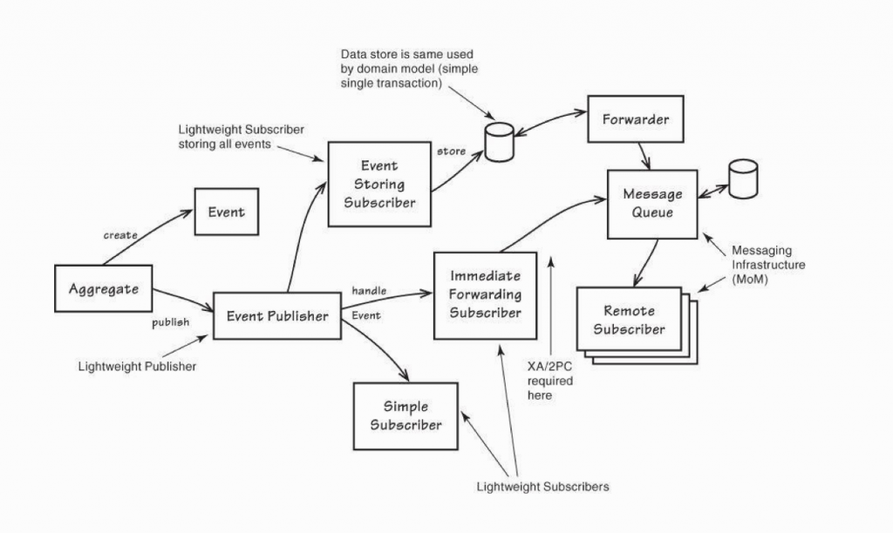

# How to implement DDD

[Sinopac CMS Architecture - HackMD](https://hackmd.io/@PNA4rcp0Ro2UdzKi89azMQ/B1iK18va9)

](assets/ddd-roadmap.png)

source: [https://raw.githubusercontent.com/FongX777/it30-domain-driven-design/master/posts/day2/ddd-roadmap.png](https://raw.githubusercontent.com/FongX777/it30-domain-driven-design/master/posts/day2/ddd-roadmap.png)

# Introduction to 3 steps


1. Business Diagnosis
    - Business Event
    - Business Logic
    - Business Category
2. Strategic Modeling
    - Bounded Context
    - Context Mapping
3. Tactical Modeling
    - Value Object
    - Entity
    - Aggregate
    - Repository
    - Domain Services
    - Domain Events
    - Modules

## Business Diagnosis(1st step)

> Defines the boundary of each domain and solutions
> 

Domain experts, Design team, and Dev team discuss by **Event Storming**

Output:

- C**larify** business problems domain and business expectations.
- **Ubiquitous** language
- **Determine** the Domain Events, Domain Objects, Domain Behaviors

## Strategic Modeling(2nd step)

> Defines the structure and method of implementation.
> 

Depart each domain into more sub-domains

Output:

- The sub-domains
- The boundary of each domain and their priority (Boundary Context)
- Their relationships and how they interact (Context Mapping)

## Tactical Modeling(3rd step)

> Defines how to code them.
> 


# Strategic Modeling


## Depart the Domain

$$
\begin{matrix}
&\text{Domain} &= &\text{Problem Space} + \text{Solution Space}\\
\\
&\text{Problem Space} &= &\text{Core Domain} + \sum\text{Supporting Subdomain} + \sum\text{Generic Subdomain}\\
\\
&\text{Solution Subdomain} &= &\sum\text{Bounded Context} + \sum\text{Context Mapping}
\end{matrix}
$$

## Problem Space

The departure of the **Problem Space** is based on the business target

### Core Domain

- The most valuable part
- Takes the greatest effort
- e.g. The editor

### Supporting Subdomain

- Support the core domain
- Should be implemented by our-self
- e.g. The infra

### Generic Subdomain

- Provides services for **Core Domain** and **Supporting Subdomain**
- Generally are ready-made tools
- e.g. Authentication

## Solution Space

The departure of the **Solution Space** is based on subdomains defined by **Problem Space**

### Bounded Context

- The same word in different **Bounded Contexts** would have different meanings(e.g. an Account in a blog, game or bank having different definitions)
- All Bounded Contexts are separate. We can be relieved to do any stuff in a Bounded Context without caring about others.
- Very good for separating the micro-services(*but a micro-service might not be a Bounded Context)
- Optimally, **one Subdomain** to **one Bounded Context**
- How do determine Bounded Contexts?
    1. By Linguistic
        - the words with close definitions
        - the words with close names have different meanings in different sentence contexts.
        - be careful to define duplicated Bounded Context
    2. By Business Capability
- What is a good Bounded Context
    - Autonomy
    - 1 Bounded Context to 1 Subdomain
- Myths
    1. Only do one times analysis: formally, a system might start from one Bounded Context or many different sizes of Bounded Contexts
    2. Separate by layers or techs: separate by Database, Infrastructure, Controller Layer, Domain Layer, or framework is not a good idea.
    3. Separate by tasks: If there is a new feature, we have batter judge that should we create a new Bounded Context for it or not.

### Context Mapping

- Defines how Bounded Contexts communicate and their relationships
- There are 8 modes:
    1. Shared Kernel
        
        > 2 Bounded Contexts sharing the same module, then they are Shared Kernel relationship
        > 
        - Minimize the shared kernel bound
        - Have batter pass their Bounded Contexts testings
        - e.g. `審核頁面Context`， `編輯頁面Context` 之間都需要有`Page` Entity
        
        
        
    2. Partnership
        
        > 2 Bounded Context need cooperate to with each other, or the task would get fail
        > 
        - Without an up/downstream relationship
        
        
        
    3. Anti-corruption Layer(ACL)
        
        > Like an adapter, ACL would transform the data from upstream to the data which downstream can accept.
        > 
        - bidirectional or single directional
        - could be a service
        - could apply [FACADE](https://refactoring.guru/design-patterns/facade) design pattern to hide the complex transformations
        - without any business logic
        - emphasis is not on the direction but on the mechanism of transformation
        - e.g. `編輯Context`中的儲存，與`儲存至bucket Context`須要轉換為靜態html
        
        
        
    4. Open Host Service/Published Language
        
        > Upstream defines a protocol let any downstream could use to define what service they need.
        > 
        - Generally, this happens when 1 upstream provides services for multiple downstream, it’s too expansive to implement all ACLs for all downstream
        - Implement with Published Language, which defines the protocol format(e.g. XML, JSON, Protocol Buffer, etc.)
            
            
            
    5. Separate Way
        
        > When the dependent relation of 2 Bounded Contexts is too complex or too expansive.
        > 
    - e.g. `編輯Context`中編輯者可能希望有類似commit功能，但我們儲存時只採用html，因此採取Separate Way，將commit功能與`編輯Context`分離
    1. Big Ball of Mud
        
        > Just literally, the system might mix into a lump already
        > 
        - sometimes others need to add an ACL when communicating with it
        - should carefully modify the internal
    2. Customer-Supplier
        
        > TODO
        > 
        
        
        
    3. Conformist
        
        > TODO
        > 
        
        
        

## An eCommerce example

Before applying Strategic Design:


First, we should determine the **Problem Space**

1. Core Domain: Recommendation System
2. Supporting Subdomain: Purchasing Requirements
3. Supporting Subdomain: Inventory Requirements
4. Generic Subdomain: Resource Planning

Secondly, determine the Bounded Context

After applying Strategic Design:


Applying Tactical Design would maybe like this:


Therefore, the project structure might be like this:

```bash
e-commerce
├── catalog
│   ├── applicationService
│   ├── domain
│   └── infrastructure
├── identity
│   ├── applicationService
│   ├── domain
│   └── infrastructure
└── purchase
    ├── applicationService
    ├── domain
    └── infrastructure
```

# ****Tactical Modeling****


## Value Object [domain object]: Don’t care about the life cycle

- Some key points:
    - **Without ID**:  we only care about **what** are they **not who**.
    - **Immutability**: therefore, if we want to update the value of a Value Object, we need to copy all attributes from this to the other.
    - **Conceptual Whole**: a **Value Object** could contain many attributes, all attributes establish a **Value Object**.
    - **Equality**: since **Value Objects** without ID, therefore, a Value Object have all same attributes as the other, we say they are equality
    - **No side effects**: It is just an attribute of **Entity**
- A simple implement, here we have a `Product` and a `Money` struct. `Money` is a **Value Object.**
    
    [LF_Golang/ddd/value_object at series/ddd · yiting-tom/LF_Golang](https://github.com/yiting-tom/LF_Golang/tree/series/ddd/ddd/value_object)
    
    ```go
    package main
    
    import (
    	"encoding/json"
    	"fmt"
    
    	log "github.com/sirupsen/logrus"
    )
    
    // Product 
    type Product struct {
    	Name string
    	Cost *Money
    	l    *log.Logger
    }
    
    // NewProduct creates a new product
    func NewProduct(name string, cost *Money, l *log.Logger) (*Product, error) {
    	if name == "" {
    		return nil, fmt.Errorf("name must not be empty")
    	}
    	return &Product{Name: name, Cost: cost, l: l}, nil
    }
    
    // AddCost adds cost to Money of the product
    func (p *Product) AddCost(amount int) error {
    	newCost, err := p.Cost.AddAmount(amount)
    	if err != nil {
    		p.l.Fatal(err)
    		return err
    	}
    	p.Cost = newCost
    	return nil
    }
    
    // Money is a value object
    type Money struct {
    	Amount   int
    	Currency string
    }
    
    // NewMoney creates a new Money
    func NewMoney(amount int, currency string) (*Money, error) {
    	if amount < 0 {
    		return nil, fmt.Errorf("amount must be positive")
    	}
    	return &Money{Amount: amount, Currency: currency}, nil
    }
    
    // AddAmount adds amount to Money, and returns a new Money
    func (m *Money) AddAmount(amount int) (*Money, error) {
    	if amount < 0 {
    		return nil, fmt.Errorf("amount must be positive")
    	}
    	newAmount := m.Amount + amount
    	return NewMoney(newAmount, m.Currency)
    }
    
    func main() {
    	p := Product{
    		Name: "coffee",
    		Cost: &Money{
    			Amount:   100,
    			Currency: "NTD",
    		},
    		l: log.New(),
    	}
    
    	p.AddCost(20)
    
    	// just for demo
    	m, _ := json.Marshal(p)
    	fmt.Printf("P = %+v", string(m))
    }
    ```
    

## Entity [domain object]: Do care about the life cycle

- Some key points:
    - **With ID**: even 2 entities with all same attributes but if they don’t have the same ID they still are not the same.
    - **Mutable**: except ID, all attributes are mutable
    - **Long lifetime**: an Entity even would not be destroyed
    - **Complex:** a system with more Entities would get more complicated, therefore, we should seriously decide whether it should be an Entity or not.
- A simple implement, here we have an `Address` **Value Object** and a `User` **Entity**.
(but generally, if the **Entity** is an **Aggregate Root**. Generate the Entity by the **Repository** would be a great way)
    
    [LF_Golang/ddd/entiry at series/ddd · yiting-tom/LF_Golang](https://github.com/yiting-tom/LF_Golang/tree/series/ddd/ddd/entiry)
    
    ```go
    package main
    
    import (
    	"encoding/json"
    	"fmt"
    
    	"github.com/google/uuid"
    )
    
    // Address is a value object for address of a User
    type Address struct {
    	City   string
    	County string
    	Street string
    	Detail string
    }
    
    // User is an entity
    type User struct {
    	Id      uuid.UUID
    	Name    string
    	Address *Address
    }
    
    // NewUser creates a new user with auto-generated uuid as id
    func NewUser(name string, address *Address) (*User, error) {
    	// generate uuid
    	newId, err := uuid.NewRandom()
    	if err != nil {
    		return nil, fmt.Errorf("failed to generate uuid: %w", err)
    	}
    
    	return &User{
    		Id:      newId,
    		Name:    name,
    		Address: address,
    	}, nil
    }
    
    // SetAddress sets the address of the user
    func (u *User) SetAddress(address *Address) {
    	u.Address = address
    }
    
    // Equals checks if two users are equal
    func (u *User) Equals(other *User) bool {
    	return u.Id == other.Id
    }
    
    // String returns the string representation of the user
    func (u *User) String() string {
    	m, err := json.Marshal(u)
    	if err != nil {
    		panic(err)
    	}
    	return string(m)
    }
    
    func main() {
    	// create a user
    	user1, _ := NewUser("John", &Address{
    		City:   "New York",
    		County: "New York",
    		Street: "Wall Street",
    		Detail: "No. 1",
    	})
    
    	user2, _ := NewUser("John", &Address{
    		City:   "New York",
    		County: "New York",
    		Street: "Wall Street",
    		Detail: "No. 1",
    	})
    
    	// print user
    	fmt.Printf("user1: %s\nuser2: %s\n", user1.String(), user2.String())
    	fmt.Printf("user1 equal to user2: %v",user1.Equals(user2))
    }
    ```
    

## Aggregate [domain object]: Provides Invariant for many objects and their relationships

- Some key points:
    - **Zone**: defines relationships of objects and their states update, so which?
        1. Relationships of models
        2. Bounds of these relationships
        3. Method to store models and relationships
        4. Should create a Repository for each Entity or not
    - **A unit of states update**: Aggregate is a set of models and their relationships. It would be seen as a unit when updating the states.
    - **Need a leader**: every **Aggregate** needs an **Entity** to be the leader, we call the Entity an **Aggregate Root**. Every event passing or state update needs to be sent by **Aggregate Root**.
- Illustration
    
    Before applying aggregate
    
    
    
    After applying aggregate, The `Order` is the leader of this Aggregate
    
    
    
- Design principle
    1. The **Aggregate Root**(is an Entity) must be unique in this **Bounded Context**, Its ID can not be reused in other **Aggregate Roots**.
    2. **Aggregate Root** needs to check all rules in this **Bounded Context**
    3. **Aggregate Root** is the only port to external.
    4. Only **Aggregate Root** could access the database.
    5. Deletion would delete the entire **Aggregate.**
    6. Even just updating a part of Aggregate. It still should satisfy all rules of this **Aggregate**(therefore, every operation should do to the entire Aggregate)
- In an implementation, **Aggregate** is much more like a concept, not an object. Therefore, generally, it would be defined as an `abstract class`.

## Factory Pattern: handle the birth of objects

- Why do we need it?
    - Aggregate is combined by multiple objects, therefore, when we create a new Aggregate it would be hard.
    - When creating an Aggregate, it might reference other Aggregate Root IDs. If there are so many Aggregates that have to be created the reference relationship would be messy.
- How to use it?
    - Aggregate produce Aggregate:
        
        e.g. A `Forum` can generate many `Discussions`, and a `Discussion` can be added many `Post`, so at first, we might have an Aggregate like this:
        
        
        
        consider that:
        
        1. A website might have many `Forum`
        2. A `Forum` might have many `Discussion`
        3. A `Discussion` might have many `Post`
        4. Each `User` can create their `Discussions`
        5. Each `User` can publish their `Posts`
        
        In the previous graph, it would be weird that if a `user` is modifying a `Discussion` content, the others can not publish any `Posts`, so we separate it into 3 Aggregates:
        
        
        
        Then we found that if a `Discussion` need to be created and the referenced `Forum` has been shut off. We can not create the `Discussion`, so we modify the 2nd image into:
        
        
        
        After modified, the dotted lines are **Factory Pattern**, a `Forum` can produce a `Discussion` by the `startDiscussion()` function, and a `Discussion` can produce a `Post` by calling the `post()` function.
        
    - implementation of `Forum` and `Discussion` Aggregates. The `Forum` would generate a `Discussion` by calling the `startDiscussion()` function.
        
        [LF_Golang/ddd/factory_pattern at series/ddd · yiting-tom/LF_Golang](https://github.com/yiting-tom/LF_Golang/tree/series/ddd/ddd/factory_pattern)
        
        ```go
        package main
        
        import (
        	"fmt"
        
        	"github.com/google/uuid"
        
        	log "github.com/sirupsen/logrus"
        )
        
        type Forum struct {
            id uuid.UUID
            Closed bool
            Subject string
            Description string
        }
        
        // StartDiscussion create a new discussion
        func (f *Forum) StartDiscussion(author *Author, subject string) (*Discussion, error) {
            // check if forum is closed
            if f.Closed {
                return nil, fmt.Errorf("Forum is closed")
            }
        
            dId, err := uuid.NewRandom()
            if err != nil {
                log.Fatal(err)
                return nil, err
            }
        
            // create a new discussion and return it
            return &Discussion{
                id: dId,
                ForumId: f.id,
                Author: author,
                Subject: subject,
            }, nil
        }
        
        type Discussion struct {
            id uuid.UUID
            ForumId uuid.UUID
            Author *Author
            Subject string
        }
        
        type Author struct {
            id uuid.UUID
            Name string
        }
        
        func main() {
            aId, _ := uuid.NewRandom()
            author := &Author{
                id: aId,
                Name: "John Doe",
            }
        
            fId, _ := uuid.NewRandom()
            forum := &Forum{
                id: fId,
                Closed: false,
                Subject: "Go",
                Description: "For discussion about Go",
            }
        
            d, _ := forum.StartDiscussion(author, "Go is a programming language")
            fmt.Printf("%+v\n", d)
        }
        ```
        

## Repository: handle the life and end of objects

- Why do we need **Repositories?**
    - The **Domain Objects** have business logic, but these objects need to be stored still.
    - We use **Repository** to manage the save/load of Aggregate, and ensure the separation of **Domain Model** and ******Data Model******
    - Easy to test(using Mock data and Mock infrastructure)
- How to implement a repository and what should we be aware of?
    - 1 **Repository** 1 **Aggregate**
    - A **Repository** is an explicit contract.
    - The **repository** only can access states by the **Aggregate Root**
    - Provides a **Façade Pattern** for hiding the details
    - Defines the boundary of a **Domain Model** and a **Data Model**
- e.g. Implementation of an `Order` Repository
    
    [LF_Golang/ddd/repository_pattern at series/ddd · yiting-tom/LF_Golang](https://github.com/yiting-tom/LF_Golang/tree/series/ddd/ddd/repository_pattern)
    
    1. Define all `interfaces` in the **Domain Layer**
    
    ```go
    // location: domain/order/order.go
    package order
    
    import "github.com/google/uuid"
    
    // OrderId is the unique identifier of an Order and it should be a Value Object
    type OrderId struct {
    	uuid.UUID
        // and other fields
    }
    
    // Order is an Entity
    type Order struct {
        id OrderId
        // and other fields
    }
    
    // OrderRepository is the interface for the OrderRepository
    type OrderRepository interface {
        GetById(id OrderId) (*Order, error)
        Save(order *Order) error
        Remove(id OrderId) error
    }
    ```
    
    1. Implement all `interfaces` in the **Infrastructure Layer**
    
    ```go
    // location: infrastructure/persistence/order/order_repository.go
    package order
    
    import (
    	"database/sql"
    
    	"github.com/yiting-tom/LF_Golang/ddd/repository_pattern/domain/order"
    )
    
    // SqlOrderRepository implements the OrderRepository interface
    type SqlOrderRepository struct {
        db *sql.DB
        // and other fields
    }
    
    // NewSqlOrderRepository returns a new SqlOrderRepository
    func NewSqlOrderRepository(db *sql.DB) *SqlOrderRepository {
        return &SqlOrderRepository{
            db: db,
            // and other fields
        }
    }
    
    // GetById returns the order with the given order.OrderId
    func (r *SqlOrderRepository) GetById(id order.OrderId) (*order.Order, error) {
        // do what should be done to get the order
        return nil, nil
    }
    
    // Save saves the order
    func (r *SqlOrderRepository) Save(order *order.Order) error {
        // do what should be done to save the order
        return nil
    }
    
    // Remove removes the Order with the given order.OrderId
    func (r *SqlOrderRepository) Remove(id order.OrderId) error {
        // do what should be done to remove the order
        return nil
    }
    ```
    

## Application Service

- What is an **Application Service?**
    - Operates the **Domain Models** and passes business logic from the interface(external service) to **Domain Model**
    - Focus on **use cases** not the details of interactions with external service
- Applying the [Clean Architecture](https://anmolsehgal.medium.com/clean-architecture-fef10b093ad0)(Screaming Architecture), so for each use case would be a single file having the following characters:
    1. Input (Request Model) struct
    2. Output (Response Model) struct
    3. A class named by use case
        - implement `execute(input): output` method
        - Clients can only access `execute()` method
    - e.g. Implement a `RegisterMember` **Application Service**
        
        ```go
        // application_service/member/registerMember.go
        package order
        
        // ApplicationService is the interface for the application service
        type ApplicationService interface {
            // Execute is the entry point for the application service
            Execute(ApplicationServiceInput) (*ApplicationServiceOutput, error)
        }
        // ApplicationServiceInput is the input for the ApplicationService
        type ApplicationServiceInput struct {}
        // ApplicationServiceOutput is the output for the ApplicationService
        type ApplicationServiceOutput struct {}
        
        // RegisterMemberInput is the input for the RegisterMember application service
        type RegisterMemberInput struct {
            ApplicationServiceInput
            Name string
            Email string                    
            Password string
        }
        
        // RegisterMemberOutput is the output for the RegisterMember application service
        type RegisterMemberOutput struct {
            ApplicationServiceOutput
            Success bool
            Member *MemberDto
            ErrorMessage string
        }
        
        // MemberDto is the data transfer object for the Member
        type MemberDto struct {
            Name string
            Email string
        }
        
        // RegisterMember is the application service for registering a new member
        type RegisterMember struct {
            ApplicationService
            // should have repository and other fields
            // but for the sake of the example we will leave it empty
            // repo *MemberRepository
        }
        
        // NewRegisterMember returns a new RegisterMember application service
        func NewRegisterMember() *RegisterMember {
            return &RegisterMember{}
        }
        
        // Execute executes the application service
        func (r *RegisterMember) Execute(input RegisterMemberInput) *RegisterMemberOutput {
            // do what should be done to register the member
            // it would operates the domain model and the repository
            return &RegisterMemberOutput{
                Success: true,
                Member: &MemberDto{
                    Name: input.Name,
                    Email: input.Email,
                },
                ErrorMessage: "",
            }
        }
        ```
        

## Domain Event

- What is a **Domain Event?**
    - Something that happened in the domain that we want other parts of the same domain to be aware of and may do some react to the events.
    - When the Domain Experts said: “when … then …”, “if … then …”
- How to implement Domain Events? take a simple illustration:
    
    
    
    1. **Aggregate** creates an **Event**
    2. **Aggregate** use **Event Publisher** to publish an **Event**
    3. The Subscriber can receive this Event by 3 ways:
        1. Event Storing Sub: Store the Event
        2. Easy Sub: Subscriber and Publisher are in the same Bounded Context
        3. Cross-System Sub: The Event would be forwarded by a Message Queue(Infrastructure) from this Bounded Context to the other.
    - e.g. Implement this Event:
    “When `publishing` a `page`, we need to check if this `page` has been `approved` be a `project manager`.
        
        We can do this analysis:
        
        - Command: `Publish Page`
        - Aggregate: `Page`, `Admin`
        - Output Event: `PagePublished`
        
        implement these 3 ways:
        
        - Callback method: passing callback for Domain Model to Handle, but this way only work when 1 Event 1 Sub
            
            [LF_Golang/ddd/domain_event/1_callback_method at series/ddd · yiting-tom/LF_Golang](https://github.com/yiting-tom/LF_Golang/tree/series/ddd/ddd/domain_event/1_callback_method)
            
            - First, we need to define the admin and page domain, and we define the `page_published` Domain Event in `domain/page/events`
                
                ```go
                // domain/page/events/page_published.go
                package events
                
                import (
                	"time"
                
                	"github.com/google/uuid"
                )
                
                // DomainEvent is the base struct for all domain events.
                type DomainEvent struct {
                	occurredAt time.Time
                	name       string
                	version    string
                }
                
                // PagePublished is the domain event for a page being published.
                type PagePublished struct {
                	DomainEvent
                	PageId  string
                	AdminId uuid.UUID
                }
                
                // NewPagePublished returns a new PagePublished domain event.
                // the occurredAt field is set to the current time.
                func NewPagePublished(pageId string, adminId uuid.UUID, version string) *PagePublished {
                	return &PagePublished{
                		DomainEvent: DomainEvent{
                			occurredAt: time.Now(),
                			name:       "PagePublished",
                			version:    version,
                		},
                		PageId:  pageId,
                		AdminId: adminId,
                	}
                }
                ```
                
                and here is the `page` domain model, we add a new field into `page` struct named `PagePublishedHandlers`, which could keep the `PagePublishedHandler` list, only when `PublishPage` (Application Service) calling `Publish` method defined in `page` domain model 
                
                ```go
                // domain/page/page.go
                package page
                
                import (
                	"time"
                
                	"github.com/google/uuid"
                	"github.com/yiting-tom/LF_Golang/ddd/domain_event/1_callback_method/domain/page/events"
                )
                
                // Page is the domain model for a page.
                type Page struct {
                	ID                    string
                	Title                 string
                	Content               string
                	State                 PageState
                	CreatedAt             time.Time
                	UpdatedAt             time.Time
                	CreatedBy             uuid.UUID
                	UpdatedBy             uuid.UUID
                	PagePublishedHandlers []PagePublishedHandler
                }
                
                // PageState is the state of a page.
                type PageState struct {
                	s string
                }
                
                var (
                	Draft       = PageState{"draft"}
                	Published   = PageState{"published"}
                	Unpublished = PageState{"unpublished"}
                	Archived    = PageState{"archived"}
                )
                
                // PageRepository is the interface for the PageRepository defined at infrastructure's persistence.
                type PageRepository interface {
                	GetById(id string) (*Page, error)
                	Create(page *Page) error
                	Update(pageId string, page *Page) error
                	Remove(id string) error
                }
                
                // PagePublishedHandler is a function which is called when a page is published.
                type PagePublishedHandler func(*events.PagePublished)
                
                // AddPagePublishedHandler adds a PagePublishedHandler to the list of PagePublishedHandlers.
                func (p *Page) AddPagePublishedHandler(handler PagePublishedHandler) {
                	p.PagePublishedHandlers = append(p.PagePublishedHandlers, handler)
                }
                
                func (p *Page) Publish(adminId uuid.UUID) {
                	event := events.NewPagePublished(p.ID, adminId, "1.0")
                	for _, handler := range p.PagePublishedHandlers {
                		handler(event)
                	}
                }
                ```
                
            - Second, define the `publish_page` Application Service in *app/page/publish_page.go*
                
                ```go
                // app/page/publish_page.go
                package page
                
                import (
                	"github.com/google/uuid"
                	"github.com/yiting-tom/LF_Golang/ddd/domain_event/1_callback_method/domain/admin"
                	"github.com/yiting-tom/LF_Golang/ddd/domain_event/1_callback_method/domain/page"
                	"github.com/yiting-tom/LF_Golang/ddd/domain_event/1_callback_method/domain/page/events"
                )
                
                // PublishPageInput is the input for the PublishPage.
                type PublishPageInput struct {
                	PageId  string
                	AdminId uuid.UUID
                }
                
                // PublishPageOutput is the output for the PublishPage.
                type PublishPageOutput struct {
                	err error
                	// and other outputs
                }
                
                // PublishPage is the application service for publishing a page.
                type PublishPage struct {
                	pageRepository  page.PageRepository
                	adminRepository admin.AdminRepository
                	// just for example
                	publishBucket interface{}
                }
                
                // NewPublishPage returns a new PublishPage application service.
                func NewPublishPage(pageRepository page.PageRepository, adminRepository admin.AdminRepository) *PublishPage {
                	return &PublishPage{
                		pageRepository:  pageRepository,
                		adminRepository: adminRepository,
                		publishBucket:   nil,
                	}
                }
                
                // Execute is the entry point for the PublishPage application service.
                func (s *PublishPage) Execute(input PublishPageInput) PublishPageOutput {
                	// 1. get the page from the repository
                	page, err := s.pageRepository.GetById(input.PageId)
                	if err != nil {
                		return PublishPageOutput{err: err}
                	}
                
                	page.AddPagePublishedHandler(s.OnPagePublished)
                	page.Publish(input.AdminId)
                
                	// go func() {
                	// 	s.publishBucket.Publish(page)
                	// }()
                
                	return PublishPageOutput{
                		err: nil,
                	}
                }
                
                func (s *PublishPage) OnPagePublished(event *events.PagePublished) {
                	// do something
                }
                ```
                
        - Publisher directly publish: A `DomainEventPublisher` would handle the Pub/Sub process
            - First, we need the `DomainEventPublisher` which would be defined in infrastructure
                
                ```go
                // infrastructure/pubsub/pubsub.go
                
                package pubsub
                
                import "time"
                
                // DomainEvent is the base struct for all domain events.
                type DomainEvent struct {
                	occurredAt time.Time
                	name       string
                	version    string
                }
                
                // DomainEventHandler is the type of the handler function for a domain event.
                type DomainEventHandler func(DomainEvent)
                
                // DomainEventPublisher is the publisher for domain events.
                type DomainEventPublisher struct {
                	// an Event could have many subscribers
                	handlersMap map[string]([]DomainEventHandler)
                }
                
                // NewDomainEventPublisher returns a new DomainEventPublisher.
                func NewDomainEventPublisher() (*DomainEventPublisher, error) {
                	return &DomainEventPublisher{
                		handlersMap: make(map[string]([]DomainEventHandler)),
                	}, nil
                }
                
                // Register registers a handler for a given event name.
                func (p *DomainEventPublisher) Register(name string, handler DomainEventHandler) {
                	// check if the name is already registered
                	if _, ok := p.handlersMap[name]; ok {
                		p.handlersMap[name] = append(p.handlersMap[name], handler)
                		return
                	}
                
                	// if not, create a new slice to store the handler
                	p.handlersMap[name] = []DomainEventHandler{handler}
                }
                
                // ClearHandler clears all handlers for a given event name.
                func (p *DomainEventPublisher) ClearHandlers(name string) {
                	p.handlersMap[name] = []DomainEventHandler{}
                }
                
                // Publish publishes a domain event to all handlers for the event name.
                func (p *DomainEventPublisher) Publish(event DomainEvent) {
                	eventName := event.name
                
                	if _, ok := p.handlersMap[eventName]; ok {
                		for _, handler := range p.handlersMap[eventName] {
                			handler(event)
                		}
                	}
                }
                
                // PublishAll publishes all domain events to all handlers.
                func (p *DomainEventPublisher) PublishAll(events []DomainEvent) {
                	for _, event := range events {
                		p.Publish(event)
                	}
                }
                ```
                
            - Second, the Application Service need to be update
                
## Domain Service
TODO...